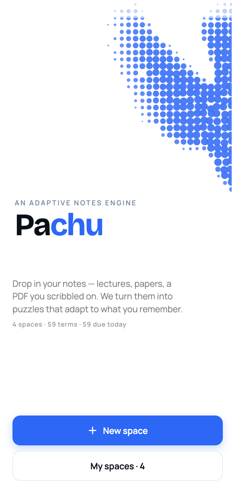
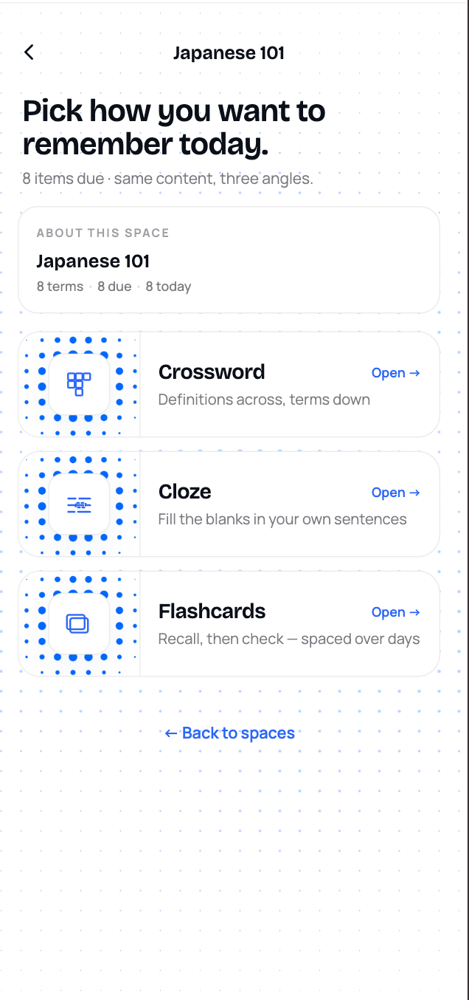
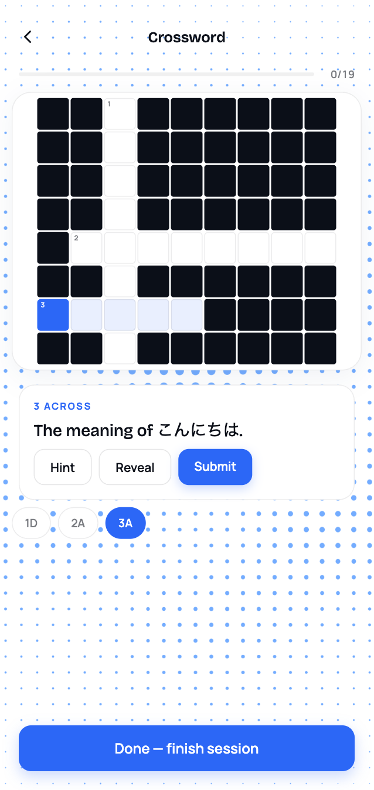
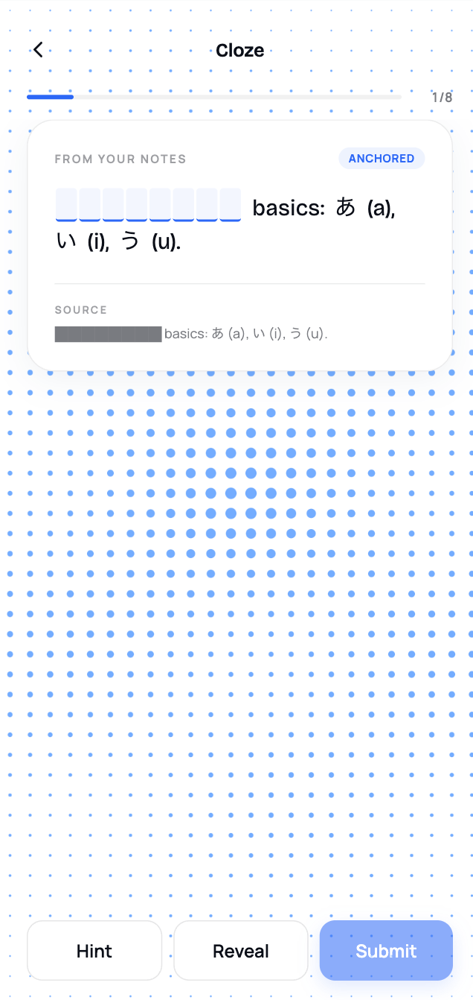
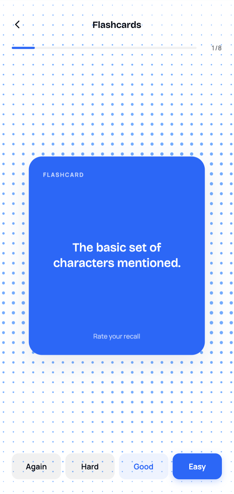
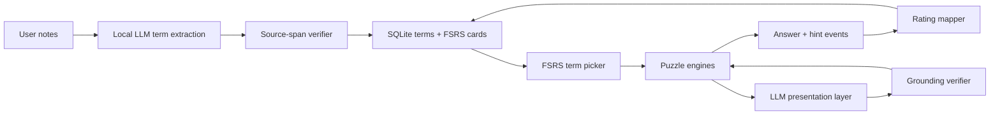

# Pachu

<p align="center">
  
  
  
  
  
</p>

Pachu is an adaptive notes engine for studying with puzzles. It uses a local AI model
to transform your own notes into practice material, and it uses FSRS scheduling to
decide what you should see next.

The core idea is deliberately split:

- **The algorithm decides what to practice.** `ts-fsrs` tracks recall strength,
  due dates, weak terms, and review ratings across every puzzle type.
- **The AI decides how to present it.** Ollama extracts verified terms from the
  user's notes, writes crossword clues in the same register, and generates cloze
  sentences only when the grounding checks pass.
- **The notes stay the source of truth.** Terms must come from literal source spans,
  and generated cloze content falls back to verbatim anchored mode when it cannot be
  verified.

That makes the app less like "AI flashcards" and more like a local tutor loop:
FSRS chooses the memory target, the LLM adapts the surface form, and the verifier
keeps the model from inventing facts.

## How it works

1. You paste or import notes into a **space**.
2. The backend stores the raw notes, then a local Ollama model extracts candidate
   terms.
3. The span verifier rejects anything that is not grounded in the notes.
4. FSRS chooses due, weak, or new terms for the next session.
5. The puzzle engine renders those terms as Crossword, Cloze, or Flashcards.
6. Your answers become review events, which update the same FSRS card state.

## AI and algorithm loop



## Puzzle modes

- **Crossword** - clues are generated to match the vocabulary level, formality, and
  tone of the source notes.
- **Cloze** - fragile cards use anchored, verbatim note sentences; stable cards may
  use generated sentences that mimic the note style and pass grounding verification.
- **Flashcards** - direct recall reviews feed the same FSRS schedule as the puzzle
  modes.

## Tech stack

- **App:** React Native + Expo
- **Backend:** Bun, Node 20, TypeScript, Express, WebSocket
- **AI:** Ollama, configured from the repo root `.env`
- **Memory algorithm:** `ts-fsrs`
- **Storage:** `bun:sqlite`
- **Shared contract:** `shared/src/types.ts`

## Repo layout

```
pachu/
  app/        # React Native + Expo
  backend/    # Node + Bun + TypeScript + Express + ws + `bun:sqlite`
  shared/     # cross-cutting TypeScript types
```

## Prerequisites

- [Bun](https://bun.sh/) 1.1+ (package manager and runtime)
- [Ollama](https://ollama.com/) running locally (`ollama serve`); model, base URL,
  and timeout are configured from the repo root `.env`
- iOS Simulator or Expo Go on a phone (same Wi-Fi as the dev laptop)

## Quick start

```bash
bun install
cp .env.example .env                   # edit to set OLLAMA_MODEL, etc.
bun run dev:backend                    # one terminal
bun run dev:app                        # another terminal
```

Backend listens on `http://localhost:4000`. The Expo app reads `EXPO_PUBLIC_API_BASE_URL` (defaults to `http://localhost:4000`).

## For contributors

- **Start here**: [`AGENTS.md`](AGENTS.md) — team coordination, conventions, live progress board.
- **Full architecture**: [`docs/PLAN.md`](docs/PLAN.md) — diagrams, anti-hallucination contract, demo script.
- **Backend API**: [`docs/API.md`](docs/API.md) — HTTP + WS surface (what's actually wired, with request/response shapes).
- **GitHub**: https://github.com/benja0rtzzz/pachu
