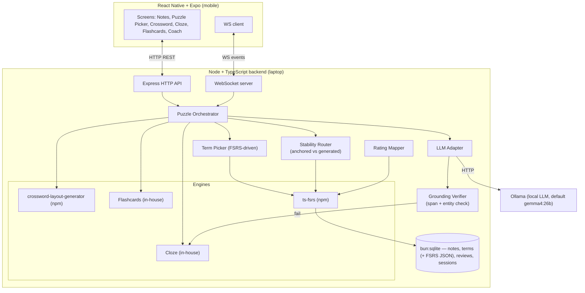
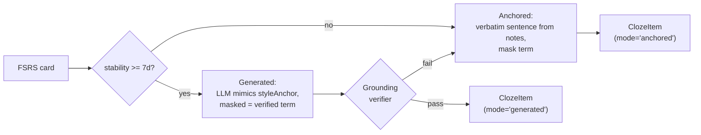

# Puzzle Forge Coach — Architecture Plan

> The "what and why" of the system. For day-to-day team coordination, conventions, and the
> live progress board, see [`AGENTS.md`](../AGENTS.md) at the repo root. For the live HTTP
> + WS surface (what's actually wired today, request/response shapes), see [`API.md`](API.md).

A React Native + Expo app backed by a Node/TypeScript orchestrator that embeds existing
libraries (`crossword-layout-generator`, `ts-fsrs`) plus an in-house Cloze engine, all
driven by a local LLM (Ollama, default `gemma4:26b`). Math (FSRS) drives what to teach;
the LLM drives how to present it. Crossword, Cloze, and Flashcards all share one
adaptive memory model.

## Architecture



## Two-layer split

- **Inner layer (standardized embedding)**: each existing library is wrapped behind a small
  interface in `backend/src/engines/*`. Same shape for all: `generate(input) -> Puzzle`,
  `validate(puzzle) -> bool`. Swappable.
- **Outer layer (RN ↔ backend)**: HTTP for request/response (generate puzzle, fetch notes,
  finish session) + WebSocket for the live coach stream (`hint`, `mistake_observed`,
  `tier_up`).

## Data flow for one session

1. User picks a notes file → `POST /notes/ingest` → backend stores raw text and asks the LLM
   to extract candidate terms (constrained to text from notes only — anti-hallucination
   tier 1). For each term, the original sentence it appeared in is stored as a
   `styleAnchor` for later prompts.
2. User picks puzzle type. **No difficulty knob, no persona** — register is inherited from
   the source notes via mimicry.
3. The **Term Picker** asks `ts-fsrs` for due/weak terms; falls back to fresh terms if user
   is new.
4. For Cloze, the **Stability Router** decides per term:
   - low stability → **anchored mode** (verbatim sentence from notes, masked)
   - high stability → **generated mode** (LLM writes a new sentence whose style mimics the
     term's `styleAnchor`; the **grounding verifier** rejects any new proper nouns / dates /
     numbers; falls back to anchored on failure)
5. The **LLM Adapter** generates clues / cloze sentences. Every prompt receives the term's
   `styleAnchor` with the instruction "match the vocabulary level, formality, and tone of
   this example sentence." Terms are always passed in verbatim from the verified term list.
6. The engine builds the puzzle (`crossword-layout-generator`, Cloze engine, or Flashcards
   engine); the orchestrator validates output.
7. Puzzle JSON returned to RN; user plays.
8. RN streams events over WS (`cell_filled`, `mistake`, `hint_requested`, `solved`).
9. On finish, the **Rating Mapper** converts per-term performance → FSRS rating (1–4) →
   write back to store.
10. Next session: smarter term selection, more cards eligible for generated cloze.

## Folder schema

```
pachu/
  app/                          # React Native + Expo
    src/
      api/                      # HTTP + WS clients
      screens/
        NotesImport.tsx
        PuzzlePicker.tsx
        Crossword.tsx
        Cloze.tsx               # fill-in-the-blank
        Flashcards.tsx
        CoachOverlay.tsx        # tiered hints UI
      components/
        Grid.tsx
        ClueList.tsx
        NotesSwitcher.tsx       # swap source notes file (demo!)
      state/
      types/
  backend/                      # Node + TypeScript (run by Bun)
    src/
      server.ts                 # express + ws bootstrap
      routes/
        notes.ts                # POST /notes/ingest, GET /notes
        puzzles.ts              # POST /puzzles/generate, POST /puzzles/:id/finish
      ws/
        coach.ts                # WS /coach
      engines/
        types.ts                # PuzzleEngine interface
        crossword.ts            # wraps crossword-layout-generator (npm)
        cloze/
          index.ts              # PuzzleEngine impl
          sentenceSplit.ts
          anchored.ts
          generated.ts
          verifier.ts           # grounding check: no new proper nouns/dates/numbers
        flashcards.ts
      memory/
        fsrs.ts                 # ts-fsrs wrapper
        termPicker.ts           # selects N due/weak/new terms
        stabilityRouter.ts      # per term: anchored vs generated cloze
        ratingMapper.ts         # puzzle event -> FSRS rating 1..4
      llm/
        adapter.ts              # interface: chat(messages, options?)
        ollama.ts               # default impl
        prompts/
          extractTerms.ts       # notes -> [{term, definition, source_span, style_anchor}]
          clueStylist.ts        # term + styleAnchor -> crossword clue (mimics anchor)
          clozeSentence.ts      # term + sourceChunk + styleAnchor -> sentence with [MASK]
          coach.ts              # mistake event -> tiered hint (style mimics user's notes)
      store/
        db.ts                   # bun:sqlite
        schema.sql
        repos/{terms,reviews,sessions,notes}.ts
      ingest/
        chunker.ts              # split notes when needed (gemma4 has 256K ctx so often unnecessary)
        textExtract.ts          # .txt/.md (PDF = stretch)
    tests/                      # bun test fixtures
  shared/
    src/
      types.ts                  # Puzzle, Term, Rating, ClozeItem, ...
  docs/
    PLAN.md                     # this file
    demo-notes/                 # seed: japanese-101, calc-2, cardio-clinical
  AGENTS.md                     # team coordination + live progress board
  README.md
```

## SQLite persistence (`backend/src/store/`)

SQLite file: `PACHU_DATA_DIR/pachu.sqlite` (default `./data`; see `AGENTS.md`). Tables:

| Table | Purpose |
| ----- | -------- |
| `notes_files` | Uploaded/pasted source: `title`, **`raw_text`**, `byte_length`, `created_at`. Tier-1 checks use `raw_text` as the notes blob. |
| `terms` | One row per extracted term (columns mirror `shared` `Term`: `term`, `definition`, `source_span`, `style_anchor`, …). **FSRS `Card` state lives here too:** `fsrs_card_json` (nullable until the memory layer first writes scheduling state) and `fsrs_card_updated_at`. No separate card table — one row per term. |
| `sessions` | A single puzzle run (`puzzle_kind`, `started_at` / `ended_at`). |
| `review_events` | Append-only grading log (`rating` 1–4, `ms`, `hints_used`, optional `session_id`). |

On startup, `db.ts` applies `schema.sql` and runs lightweight **migrations** (e.g. adding new columns to an existing `terms` table from an older checkout).

## Key file sketches

### `backend/src/engines/types.ts`

```ts
export interface PuzzleEngine<TInput, TPuzzle> {
  id: 'crossword' | 'cloze' | 'flashcards';
  generate(input: TInput): Promise<TPuzzle>;
  validate(puzzle: TPuzzle): boolean;
}

export interface ClueEntry { term: string; clue: string; sourceSpan?: string; }

export interface Term {
  id: string;
  notesFileId: string;
  term: string;
  definition: string;
  sourceSpan: string;     // verified substring of the notes
  styleAnchor: string;    // the original sentence the term appeared in (drives register mimicry)
}

export interface ClozeItem {
  termId: string;
  sentence: string;       // contains [MASK] where the term goes
  answer: string;         // the verified term
  mode: 'anchored' | 'generated';
  sourceChunk: string;    // for verifier + audit trail
}
```

### `backend/src/engines/cloze/verifier.ts` — the grounding contract

```ts
// Reject sentences that introduce facts not in the source chunk.
// Cheap: regex for proper nouns / digits / common date formats.
export function verifyGrounding(generated: string, source: string): boolean {
  const entities = extractEntities(generated); // ["Capitalized", "1862", "March 3"]
  return entities.every((e) => source.includes(e));
}
```

### `backend/src/memory/ratingMapper.ts` — puzzle-specific bit

```ts
export function mapCrossword(e: { hintsUsed: number; revealed: boolean; ms: number }) {
  if (e.revealed) return 1;
  if (e.hintsUsed >= 2) return 2;
  if (e.ms < 30_000 && e.hintsUsed === 0) return 4;
  return 3;
}

export function mapCloze(e: { correct: boolean; attempts: number; hintsUsed: number }) {
  if (!e.correct) return 1;
  if (e.attempts > 1 || e.hintsUsed > 0) return 2;
  return 4;
}
```

### `backend/src/memory/stabilityRouter.ts`

```ts
const STABILITY_THRESHOLD_DAYS = 7;
export function clozeMode(card: FsrsCard): 'anchored' | 'generated' {
  return card.stability < STABILITY_THRESHOLD_DAYS ? 'anchored' : 'generated';
}
```

### `backend/src/llm/prompts/clozeSentence.ts` — the source-mimicry prompt

```ts
export const clozeSentencePrompt = (
  term: string, sourceChunk: string, styleAnchor: string
) => `Write ONE sentence that tests whether a reader knows the meaning of "${term}".
Replace "${term}" with the token [MASK] in your output.

Style requirements (CRITICAL):
- Match the vocabulary level, formality, sentence length, and tone of this example
  sentence from the user's own notes:
  "${styleAnchor}"

Grounding requirements (CRITICAL):
- Do not introduce any proper nouns, dates, numbers, or specific claims that are
  not present in this source chunk:
  "${sourceChunk}"
- The masked answer must be exactly "${term}".

Return only the sentence, nothing else.`;
```

## Register strategy: source-mimicry (no personas)

Register is never picked by the user and never set by a global toggle. It is **inherited
from the user's notes** by passing the `styleAnchor` (the original sentence each term
appeared in) into every clue/cloze/coach prompt with a "match this style" instruction. The
LLM mimics. Multi-domain notes get per-section-appropriate output automatically.

This is the honest version of the system: the LLM and FSRS join forces to teach the user,
and the *only* style signal is the user's own writing. There is no kid/adult/pro mode and
no difficulty knob — difficulty is entirely algorithmic (term selection + cloze mode +
distractor confusability), all FSRS-derived.

## Anti-hallucination contract (two tiers)

**Tier 1 — Terms are pinned to the notes.** The `extractTerms` prompt returns
`{term, definition, source_span}` and we reject any row whose `source_span` substring is
not in the original notes (cheap O(n) check). Clue and cloze generation are then
constrained to those approved terms. The masked answer in a cloze is *always* a verified
term.

**Tier 2 — Generated cloze sentences must be grounded.** When the Stability Router picks
generated mode, the LLM is given `{term, definition, sourceChunk, styleAnchor}` and
instructed to not introduce any proper nouns, dates, numbers, or specific claims not
present in the source chunk. A programmatic verifier extracts entities (capitalized words,
digits, date patterns) from the generated sentence and requires every one to appear in the
source chunk. On failure, the engine **silently falls back to anchored mode** so the demo
never breaks.

Both tiers are enforced in code, not in the prompt.

## Cloze hybrid mode (locked)



Anchored mode is the safety net. Generated mode is where transfer learning happens — the
user sees the term in a *new* sentence whose register still feels like their own notes.

## Demo script (notes-driven, not persona-driven)

Three pre-seeded notes files of distinctly different register live in the demo:

- `japanese-101.md` — beginner language learning, simple grammar, casual tone
- `calc-2.md` — undergrad math, formal definitions, mid-formality
- `cardio-clinical.md` — clinical medicine, dense jargon, terse register

Demo flow:

1. Pick `japanese-101.md` → generate crossword + cloze. Output is simple, friendly,
   beginner-appropriate.
2. Tap NotesSwitcher → pick `calc-2.md` → regenerate. Same UI, same code path. Output is
   mathematical, formal, mid-level.
3. Tap NotesSwitcher → pick `cardio-clinical.md` → regenerate. Same UI. Output is
   technical, terse, clinical.
4. Then return to `japanese-101.md`, deliberately fail two cards, regenerate. Those two
   terms come back in anchored cloze with tougher distractors. **FSRS visibly working.**

The takeaway for judges: the system reads the user's context — it doesn't pretend the user
has three personalities. The persona switcher was theater; this is the system actually
adapting.

## Stretch goals (explicitly out of MVP)

- Connections-style grouping puzzle (16 terms, 4 categories) — strong demo addition if time
- Word search as a non-FSRS-writing warmup mode (visual variety, doesn't pollute the model)
- Speech / listening practice (Whisper + system TTS)
- Multilingual clue and cloze generation (one prompt swap, but needs eval)
- `.apkg` import (Anki interop)
- PDF notes extraction
- Cloud LLM fallback adapter

## Tech choices locked

- **App**: React Native + Expo SDK 54 (faster iteration than bare RN for a hackathon)
- **Runtime + package manager**: Bun (native TS, `bun:sqlite` built-in, fast install)
- **Backend**: Express, `ws`, `bun:sqlite`
- **Embedded npm libs**: `crossword-layout-generator`, `ts-fsrs` (both MIT)
- **In-house engines**: Cloze (sentence splitter + anchored/generated modes + grounding
  verifier), Flashcards (thin wrapper over FSRS)
- **LLM**: Ollama HTTP API at `http://localhost:11434` (default model: `gemma4:26b`); the
  adapter interface allows swapping to llama.cpp / MLX without touching call sites.
